README – LAB 4 : Analyse Statique d’un APK
Auteur

Chaimaa ELGADAOUI
Étudiante en 2ème année – Génie Cyberdéfense et Systèmes de Télécommunications Embarqués
## Description du projet

Ce projet s’inscrit dans le cadre d’un laboratoire pratique dédié à l’analyse statique des applications Android (APK).

L’objectif principal est d’examiner une application Android sans l’exécuter, afin d’identifier :

sa structure interne
ses composants
ses permissions
et d’éventuelles vulnérabilités de sécurité

Cette analyse a été réalisée dans un environnement contrôlé à des fins pédagogiques uniquement.

## Objectifs du LAB
-Comprendre la structure d’un fichier APK (DEX, Manifest, ressources…)
-Analyser le fichier AndroidManifest.xml
-Décompiler une application avec JADX GUI
-Convertir des fichiers DEX → JAR avec dex2jar
-Explorer le code avec JD-GUI
-Identifier des vulnérabilités potentielles :
     -clés API exposées
     -données sensibles en clair
     -configurations dangereuses

## Structure du projet
APK-Analysis/
│
├── app-debug.apk          # APK analysé
├── dex_out/               # Fichiers DEX extraits
├── app.jar                # Fichier converti
├
│
│
└── README.md              # Ce fichier
## Étapes réalisées
Création de l’environnement de travail
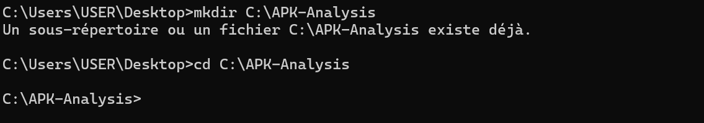
Vérification de l’intégrité de l’APK (signature ZIP)
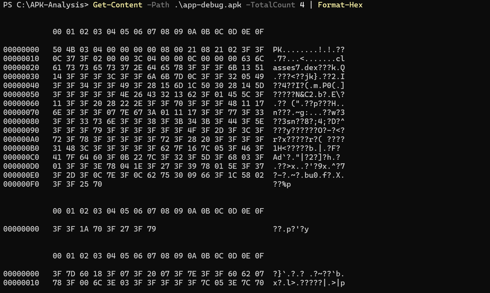
Lister le contenu de l'APK
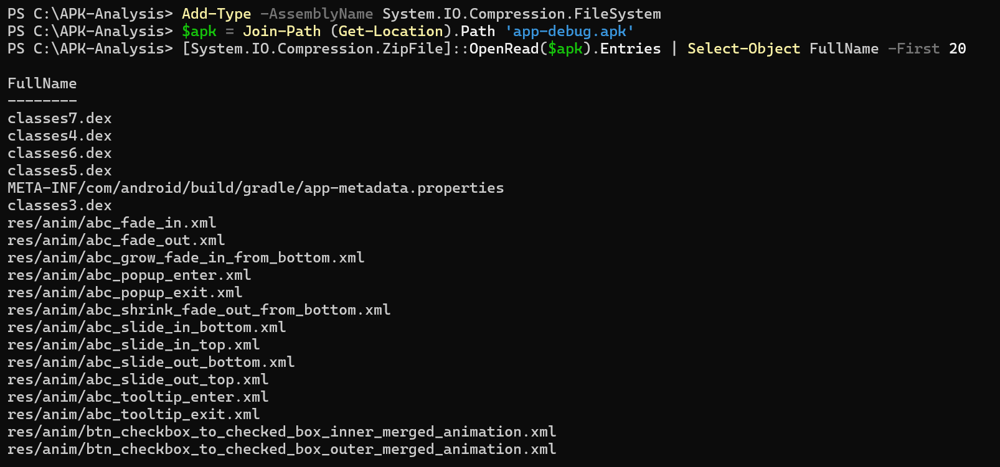
Calcul du hash SHA-256
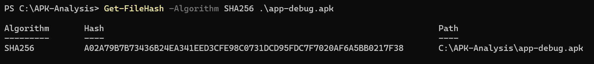

## 2. Analyse de la structure

Identification des fichiers clés :

  -AndroidManifest.xml
  -classes.dex
  -resources.arsc
  -META-INF
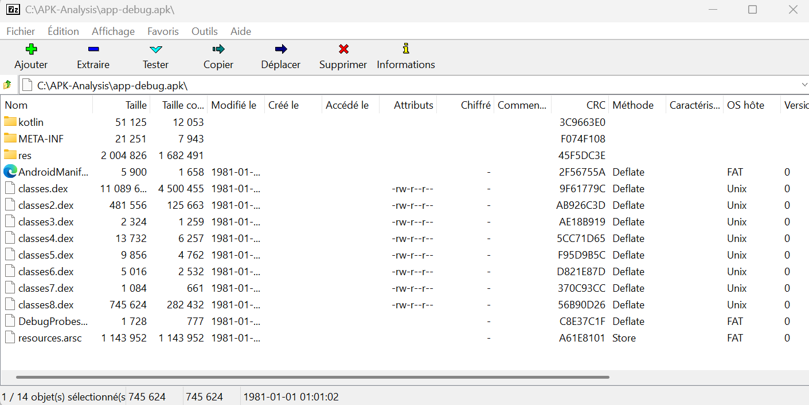
## 3. Analyse avec JADX GUI

Étude du manifeste (permissions, composants)
Vérification des attributs critiques :

android:exported
android:debuggable
usesCleartextTraffic

Exploration du code source
Image 1 (interface globale) :
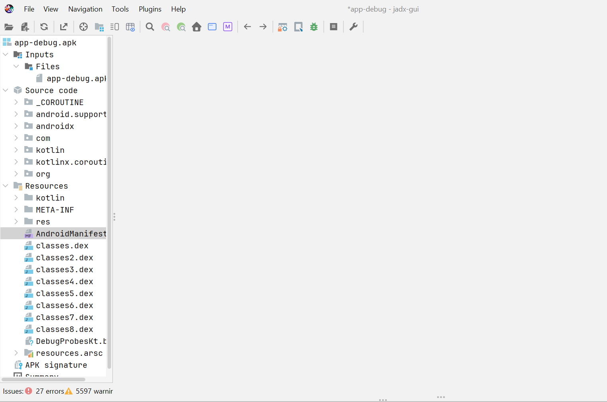
Image 2 (manifest) :
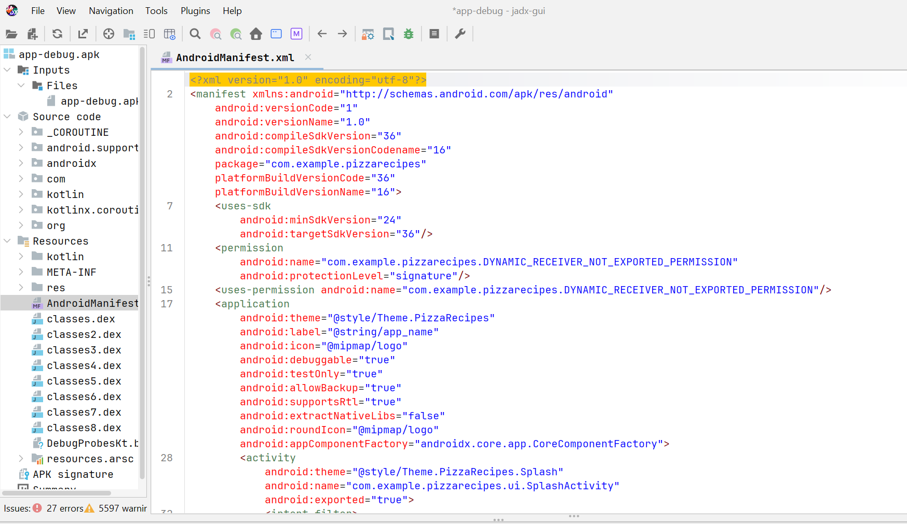

## 4. Recherche de données sensibles

Analyse basée sur des mots-clés :

    -API keys, tokens, passwords
    -URLs (HTTP/HTTPS)
    -Configurations debug/test
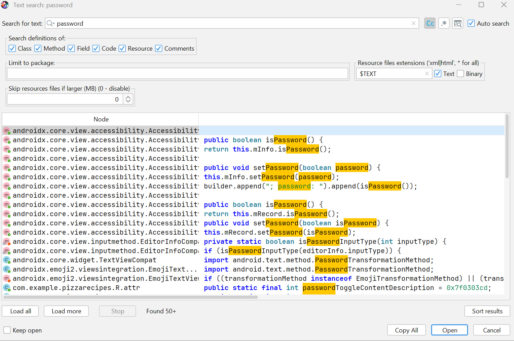
## 5. Conversion DEX → JAR

Extraction des fichiers DEX
Conversion avec dex2jar
Analyse complémentaire avec JD-GUI

Image 1 (dex) :
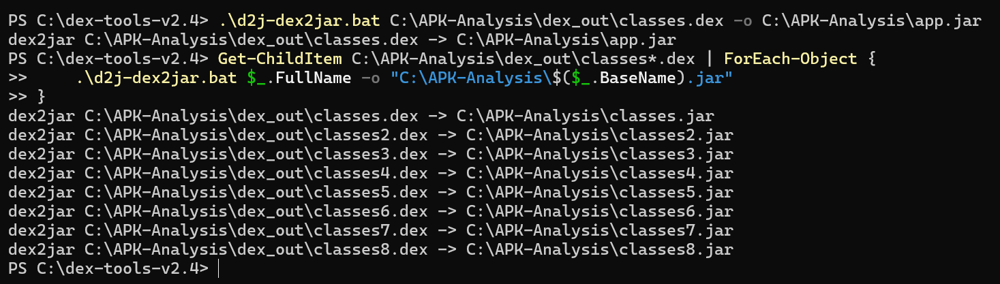

Image 2 (JD-GUI) :

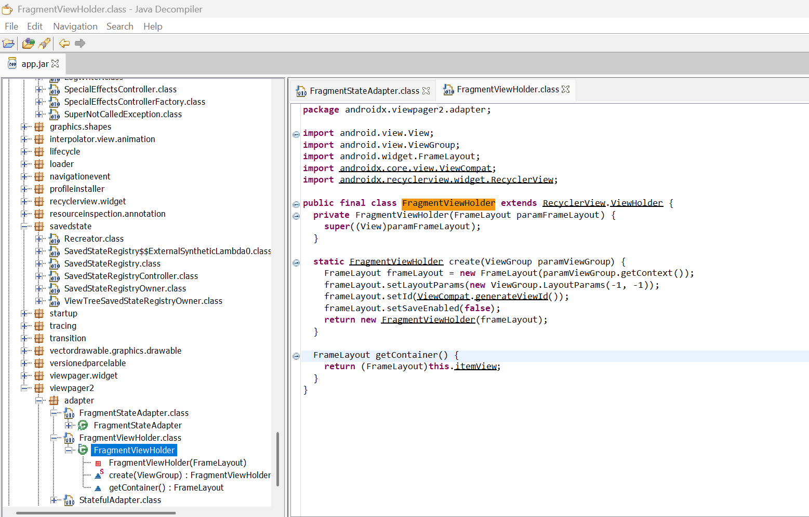

## 6. Comparaison des outils
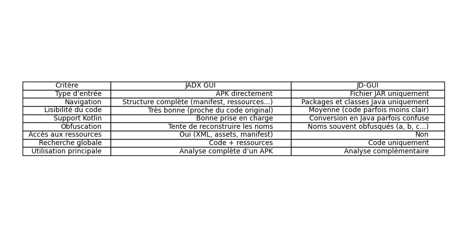